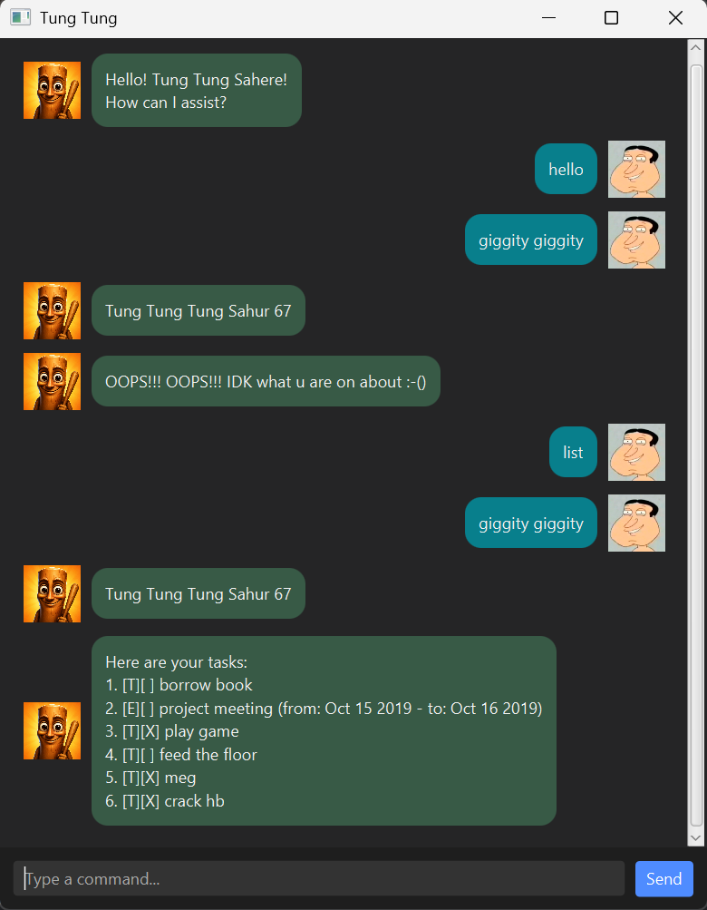

# TungTung User Guide

TungTung is a desktop chatbot that helps you keep track of tasks, deadlines, and events.
Type a command to add work, find a task, or mark it as done. Your task list is saved automatically.



[Quick start](#quick-start) · [Features](#features) · [Saving your tasks](#saving-your-tasks) · [Troubleshooting](#troubleshooting) · [Command summary](#command-summary)

## Quick start

1. Install **Java 25**. Run `java -version` in a terminal to check your version.
2. Copy `tungtung.jar` into a folder where you want to keep your tasks. If you built the project yourself, the JAR is in `build/libs/`.
3. Open a terminal in that folder and run:

   ```text
   java -jar tungtung.jar
   ```

4. In the chat window, type `todo read book` and press **Enter** or click **Send**.
5. Type `list` to see your tasks. Use `bye` to close the app.

Always launch from the same folder so TungTung can find your saved tasks.

## Features

### Command basics

- Commands are lowercase and case-sensitive: use `list`, not `List`.
- Replace uppercase placeholders such as `DESCRIPTION` and `NUMBER` with your own values; do not type the placeholders.
- Enter one command per line, using the spaces shown in the examples.
- Dates use `yyyy-MM-dd`, such as `2026-09-18`. Times and words such as `tomorrow` are not supported.
- Descriptions cannot be empty, contain a space–pipe–space separator (` | `), or end with a space followed by a pipe (` |`).

### Add a todo

Create a task without a date.

**Format:** `todo DESCRIPTION`

**Example:** `todo read book`

The new task appears as `[T][ ] read book`.

### Add a deadline

Create a task with a due date.

**Format:** `deadline DESCRIPTION /by DATE`

**Example:** `deadline return book /by 2026-09-18`

The new task appears as `[D][ ] return book (by: Sep 18 2026)`.

### Add an event

Create a task with a start date and an end date.

**Format:** `event DESCRIPTION /from START_DATE /to END_DATE`

**Example:** `event project meeting /from 2026-09-17 /to 2026-09-18`

The new task appears as `[E][ ] project meeting (from: Sep 17 2026 - to: Sep 18 2026)`.
Use `/from` and `/to` exactly once, in that order. The end date must be on or after the start date.

### List all tasks

**Format:** `list`

For example, after adding the three tasks above to an empty list:

```text
Here are your tasks:
1. [T][ ] read book
2. [D][ ] return book (by: Sep 18 2026)
3. [E][ ] project meeting (from: Sep 17 2026 - to: Sep 18 2026)
```

`[T]`, `[D]`, and `[E]` mean todo, deadline, and event. `[ ]` means unfinished; `[X]` means done.
Completed tasks stay in the list until you delete them.

### Mark or unmark a task

**Formats:** `mark NUMBER` and `unmark NUMBER`

**Example:** `mark 1` marks task 1 as done, changing `[T][ ] read book` to `[T][X] read book`.
Use `unmark 1` to make it unfinished again.

`NUMBER` must be a positive whole number shown in your current task list.

### Find tasks

Search task descriptions for matching text.

**Format:** `find KEYWORD`

**Example:** `find book` finds both `read book` and `return book`.

Search ignores letter case and matches part of a description: `find BOOK` and `find boo` also match.
Multiple words are treated as one phrase: `find read book` searches for that exact phrase, ignoring case.
Dates and completion status are not searched.

Results keep their **full-list numbers**. If a result is numbered 3, use `mark 3` or `delete 3` for that task.

### Sort tasks by date

**Format:** `sort by deadline`

Tasks are ordered from earliest to latest, using deadline dates and event start dates.
Todos come last. Tasks with the same date keep their previous relative order.
The new order is saved; descending order is not supported.

### Delete a task

**Format:** `delete NUMBER`

**Example:** `delete 2` removes task 2 and reports how many tasks remain.

Deletion has no undo command. **Run `list` again after deleting or sorting:** task numbers may have changed.

### Exit

**Format:** `bye`

TungTung says goodbye and closes the window. Successful task changes are already saved.

## Saving your tasks

TungTung saves after each successful addition, deletion, status change, or sort.
There is no separate save command. Tasks are loaded again when you restart.

Your data is in `data/tungtung.txt`, relative to the folder from which you launch the app.
To back up your tasks, close the app and copy this file somewhere safe.
To restore a backup, close all copies of TungTung, replace the data file with the backup, and restart.
Leave the adjacent `.lock` file in place; TungTung uses it to coordinate saves.

## Troubleshooting

| Problem | What to do |
| --- | --- |
| Java is not found, or the JAR cannot start | Check that Java 25 is installed and `java -version` works. Run the launch command from the folder containing `tungtung.jar`. |
| A command or date is rejected | Check its format above. Use a real calendar date and provide all required details. |
| A task number is rejected | Run `list` and use a number currently displayed. |
| No tasks match your search | Try a shorter part of the task description. |
| A save fails | The attempted change is undone. Check the error details and that the launch folder is writable, then retry. |
| Saved tasks changed outside this session | Restart to load the latest tasks before making more changes. Avoid editing the file while the app is open. |
| Saved tasks cannot be loaded | The GUI displays an error and blocks task changes. Close the app, back up the file, then restore a valid backup or correct the reported data problem before restarting. |
| Tasks seem to have disappeared | Check that you launched from the same folder as before and that its `data/tungtung.txt` is present. |

## Command summary

| Action | Example |
| --- | --- |
| Add a todo | `todo read book` |
| Add a deadline | `deadline return book /by 2026-09-18` |
| Add an event | `event project meeting /from 2026-09-17 /to 2026-09-18` |
| List tasks | `list` |
| Mark done | `mark 1` |
| Mark unfinished | `unmark 1` |
| Find tasks | `find book` |
| Sort by date | `sort by deadline` |
| Delete a task | `delete 2` |
| Exit | `bye` |
